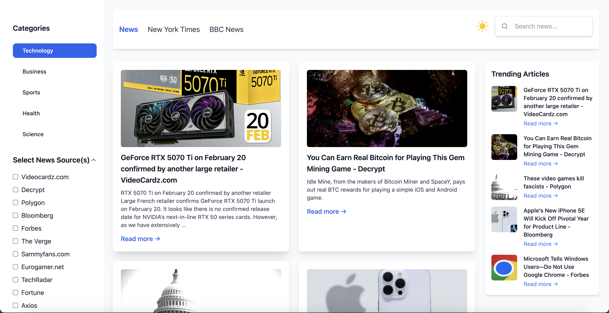
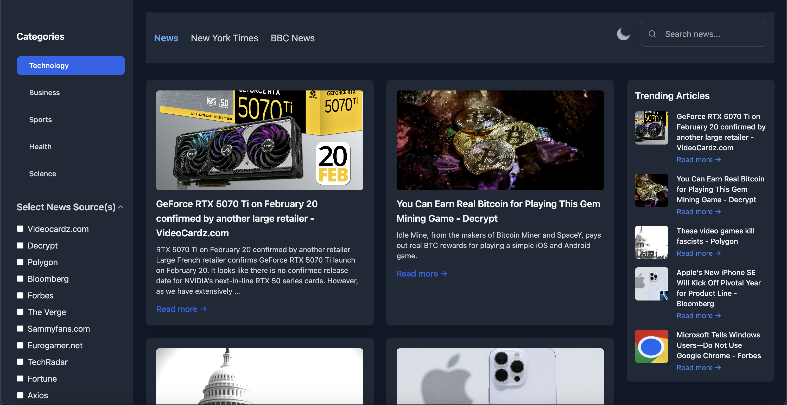
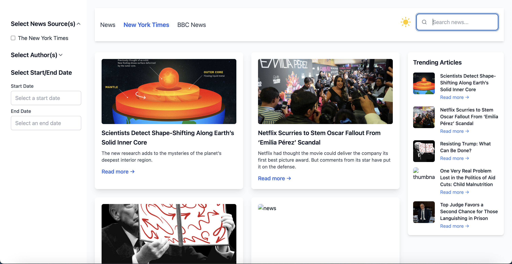
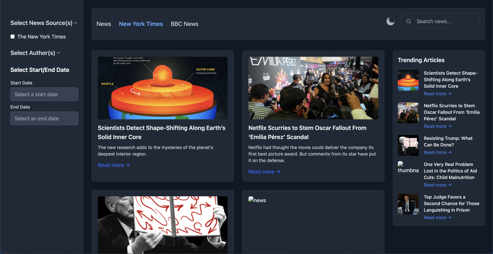
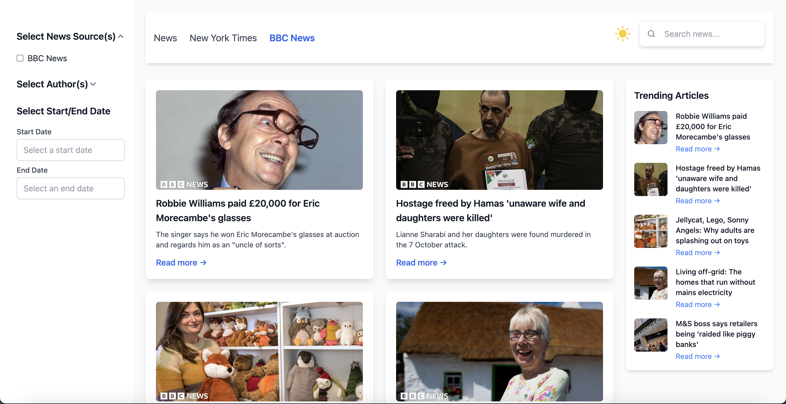
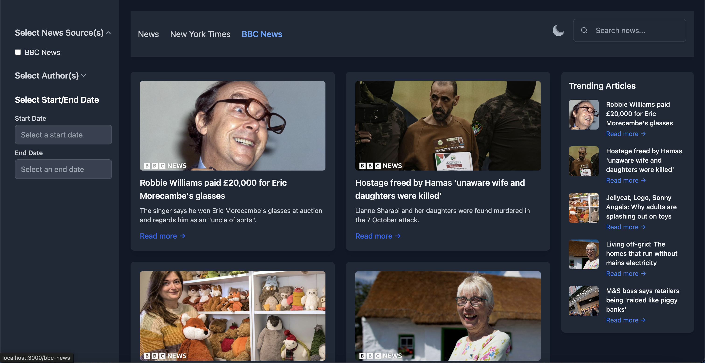

# Innoscripta News Aggregator

Welcome to the News Aggregator Website! This is a modern web application that aggregates news from various sources and categories, such as Technology, Business, Sports, Health, Science, and more. Users can view news articles, filter by category, and enjoy a smooth and responsive user interface.

### Browse News

The home page will display trending articles. You can filter news by categories such as Technology, Business, Sports, and more.

### Search

Use the search bar to look for specific news articles by entering keywords.

### Light/Night Mode

Switch between light and night modes to suit your preference.

### News Page



#### Night Mode



### New York Times



#### Night Mode



### BBC



#### Night Mode



## Table of Contents

- [Features](#features)
- [Tech Stack](#tech-stack)
- [Getting Started](#getting-started)
- [Usage](#usage)
- [Scripts](#scripts)
- [Contributing](#contributing)

## Features

- **Dynamic News Feed**: Fetch and display news from multiple sources like BBC, New York Times, and more.
- **Category-Based News**: Filter news by categories such as Technology, Business, Sports, Health, etc.
- **Search Functionality**: Search for specific news articles by keyword.
- **Light/Dark Mode**: Toggle between light and dark modes for a better reading experience.
- **Responsive Design**: The app is fully responsive and works seamlessly across devices, from mobile phones to desktops.
- **Lazy Loading**: News components are lazy-loaded for improved performance and faster load times.

## Tech Stack

- **Frontend**: React.js, TypeScript, Tailwind CSS
- **Routing**: React Router
- **State Management**: Redux Toolkit
- **API**: News API integration to fetch news data from various sources
- **Lazy Loading**: React.lazy for optimizing loading performance
- **SEO**: React Helmet for dynamic page titles and metadata
- **Routing**: React Router for dynamic navigation
- **Others**: React Suspense, Axios for HTTP requests

## Installation

### 1. Clone the Repository

```bash
git clone https://github.com/salmanbukhari37/scripta-news-ui.git
cd scripta-news-ui.git
```

## Usage

`Note`: Rename the `.local.env` file to `.env`.

### Install the packages

#### Npm

```
npm install
```

### Run the Project

#### Npm

```
npm run start
```

### Building for Production

To create a production build of your application, run:

#### NPM

```
npm run build
```

The build artifacts will be stored in the `build` directory.

## Scripts

This project includes the following scripts:

- `start:` Starts the development server.
- `build:` Builds the app for production.
- `test:` Runs the test suite.
- `eject:` Removes the single build dependency from your project.
- `docker-start:` start docker-start script in `package.json`, which uses `docker-compose up --build` to start the app

## Contributing

Contributions are welcome! If you'd like to contribute, please fork the repository and submit a pull request.
